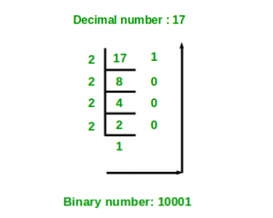
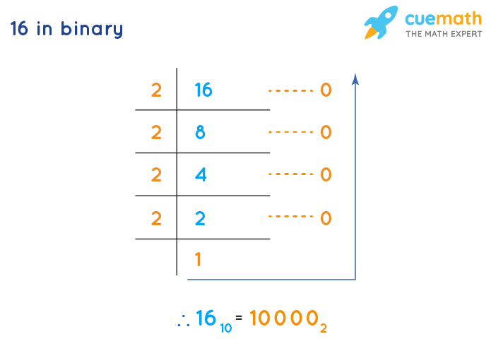

# Numbers in solidity
Numbers can be represented in Solidity in four different ways
- Decimal: Solidity supports decimal literals like any other programming language. For example: uint256 x = 123;
- Hexadecimal: Solidity supports hexadecimal literals. For example: uint256 x = 0xff;
- Binary: Solidity also supports binary literals. For example: uint256 x = 0b1010; 
- Octal: Solidity does not directly support octal literals, but they can be represented in hexadecimal form by prefixing the number with 0o. For example: uint256 x = 0o10; would represent the decimal number 8.

### Lets convert 2 into these types
- Decimal: uint256 x = 2;
- Hexadecimal: uint256 x = 0x2;
- Binary: uint256 x = 0b10; (the 0b helps compiler understand the number is in binary form)

## Binary
binary is a base-2 numbering system that uses only two digits, 0 and 1, to represent numbers. Each digit in a binary number is called a "bit."
While binary is used for positive numbers(unsigned), there are also negative numbers. For those we use Two's complement notation (a method for representing signed integers in binary form. It is the most common way of representing signed integers in computers. In two's complement notation, the leftmost bit, which is called the "sign bit," represents the sign of the number).

In the following example the binary is only 100. But we have extra number on the left side because we are using 8 bits to represent the number, and when the have a positive number those place holders are 0.

- signbit 0 = positive number
- signbit 1 = negative number

.

### Let's convert some numbers into binary

-**17 Binary**

- To convert this number into Two's Complement Notation (binary of -17), we will follow this flow 

**Binary of 17--->Invert all the numbers---->Add 1 to number** (if a number is already 1, adding 1 to it will make it 0).

==10001---->01110---->01111== (we add 1 from the far right side and carry the remainder to next number, if the far right number was 1, it would be converted to 0 and 1 would be transfered to next number until it reached a number that was 0 converting it to 1)

-**16 Binary using 8 bits**

 **Binary of 16--->Invert all the numbers---->Add 1 to number** 

==00010000--->111011111--->11110000== (in the first step the first three 0 fron the left are place holders for 8bit number showin that number is positive)